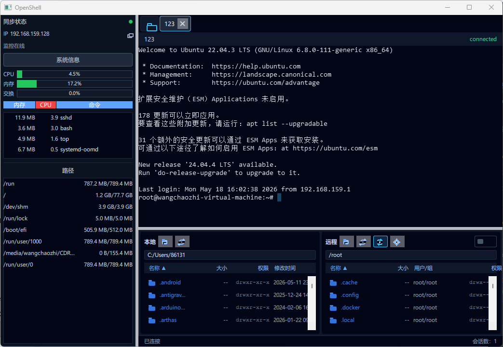

# OpenShell

[English](README.md) | 简体中文 | [日本語](README-JP.md)

OpenShell 是一个基于 Qt 6 / QML / C++20 的跨平台 SSH / SFTP / Telnet 终端工具，目标体验类似 FinalShell：左侧连接管理，中间多标签终端，下方本地/远程双栏文件管理。

当前项目已经具备可用骨架和部分真实能力：SSH 登录、Telnet 终端、终端渲染、SFTP 浏览与传输、远程文件打开/编辑回传、系统托盘和基础多语言。



## 功能

- 连接 Profile 管理：名称、协议、主机、端口、用户名、密码/私钥/Agent、分组和备注。
- SSH 终端会话：基于 libssh2 的真实连接，支持多标签、窗口 resize、Ctrl+C 中断。
- Telnet 终端会话：明文 TCP，支持基础 IAC 协商、可配置终端类型、窗口尺寸上报，并可按常见 `login:` / `Username:` / `Password:` 提示自动填充用户名/密码。Telnet 仅用于终端；SFTP、监控、跳板机和端口转发需要 SSH。
- 终端渲染：自研 libvterm + `QQuickPaintedItem` 渲染，支持清屏、光标、基础颜色和文本属性。
- 终端选择复制：拖选复制、全选、双击选词、三击选行、Shift 扩展选择、选中即复制。
- SFTP 双栏文件管理：本地/远程目录浏览，排序，上传、下载、删除、重命名、新建文件/文件夹、权限修改。
- 远程目录同步：可将远程文件栏自动同步到终端 prompt 所在目录。
- 远程文件打开：双击远程文件可用系统默认应用、指定文本编辑器或内置编辑器打开。
- 编辑回传：外部编辑器保存后自动上传回远程；内置编辑器保存时上传回远程。
- 跳板机（ProxyJump）：通过自定义 libssh2 send/recv 回调走 `direct-tcpip` 通道连接目标。
- 本地端口转发（`-L`）：在本地绑定端口、经会话隧道转发到远程目标。Remote（`-R`）/ Dynamic（`-D`）尚未实现，触发时会给出明确报错。
- 断线自动重连：每个连接可配置开关，按指数退避（封顶 30 秒）。
- 凭据安全：密码 / 私钥口令进系统钥匙串（桌面经 QtKeychain 对应 macOS Keychain / Windows 凭据管理器 / Linux libsecret；iOS 用原生 Sec API）。旧 JSON 残留的明文会在首次加载时迁移进钥匙串。
- 系统托盘：支持隐藏/显示窗口、快速打开连接、切换语言、退出。
- 多语言：英文、简体中文、日文、韩文、德文以编译后的 `.qm` 资源内置；英文走源串兜底。

## 环境要求

- Qt 6.6+，需要 `Quick`、`QuickControls2`、`Widgets`、`Network`、`Concurrent`、`LinguistTools`，测试需要 `Test`。
- CMake 3.16+。
- C++20 编译器：Windows 推荐 MSVC 2022，Linux/macOS 可用 GCC/Clang。
- Windows 推荐安装 Qt `msvc2022_64` 套件，不要混用 MinGW。

## 构建

### Windows 推荐脚本

```bat
scripts\run-vs-debug.bat
```

如需指定 CMake 或 Qt 路径：

```bat
set "CMAKE_EXE=E:\Qt\Tools\CMake_64\bin\cmake.exe"
set "QT_PREFIX=E:\Qt\6.11.1\msvc2022_64"
scripts\run-vs-debug.bat
```

部署 Qt 运行时：

```bat
scripts\deploy-vs-debug.bat
scripts\deploy-vs-release.bat
```

### CMake

```bash
cmake -S . -B build -DCMAKE_PREFIX_PATH=/path/to/Qt
cmake --build build --config Debug
```

启用测试：

```bash
cmake -S . -B build -DOPENSHELL_BUILD_TESTS=ON -DCMAKE_PREFIX_PATH=/path/to/Qt
cmake --build build --config Debug
ctest --test-dir build
```

## 项目结构

```text
.
├── CMakeLists.txt
├── Main.qml
├── src/
│   ├── AppController.*          # 应用中枢，连接 QML、会话、SFTP、设置、托盘
│   ├── ConnectionCatalog.*      # 连接 Profile 读写
│   ├── SessionController.*      # 活动 SSH/Telnet 会话管理
│   ├── SettingsStore.*          # QSettings 封装
│   ├── TranslationManager.*     # 语言切换
│   ├── TrayController.*         # 系统托盘
│   ├── ssh/                     # SSH/Telnet worker 与 SFTP 远程文件操作
│   └── terminal/                # libvterm 屏幕模型与 QML 绘制控件
├── qml/
│   ├── MainWindow.qml
│   ├── Sidebar.qml
│   ├── ConnectionEditor.qml
│   ├── SessionTabs.qml
│   ├── TerminalView.qml
│   ├── FileBrowser.qml
│   └── AccentCard.qml
├── translations/
│   ├── OpenShell_zh_CN.ts
│   ├── OpenShell_ja_JP.ts
│   ├── OpenShell_ko_KR.ts
│   └── OpenShell_de_DE.ts
├── tests/
│   ├── test_connection_catalog.cpp
│   ├── test_vt_screen.cpp
│   ├── test_session_controller.cpp
│   ├── test_sftp_transfer.cpp
│   └── test_sftp_connection_pool.cpp
└── docs/
    ├── architecture.md
    ├── mobile-adaptation-plan.md
    └── connection-encryption-design.md
```

## 数据存储

连接配置保存到：

```text
QStandardPaths::AppDataLocation/connections/<id>.json
```

密码和私钥口令（含跳板机凭据）保存在操作系统的钥匙串里——桌面端经 QtKeychain 走 macOS Keychain / Windows 凭据管理器 / Linux libsecret，iOS 直接调原生 Sec API。JSON 文件里不再写这些字段，旧版本残留的明文会在首次加载时迁移进钥匙串。Android 当前是 base64 写入 app 沙箱 `QSettings` 的占位实现，沙箱保护但 **未在静止状态下加密**，后续会换成 AndroidKeyStore + AES-GCM，见 [AGENTS.md](AGENTS.md)。

整个 JSON 文件的可选加密（方便 Git 同步）尚未实现，设计草稿见 [docs/connection-encryption-design.md](docs/connection-encryption-design.md)。

远程文件“打开/编辑”会先下载到系统临时目录：

```text
<Temp>/OpenShell/remote-open/<uuid>/
```

启用自动回传时，OpenShell 会监听该临时文件修改并上传回原远程路径。

## 常用操作

- 双击左侧连接：打开 SSH 或 Telnet 会话。
- 终端右键：复制、粘贴、全选、发送 Ctrl+C、清屏。
- 终端拖选：松开后自动复制。
- 终端双击/三击：选词/选行并自动复制。
- 远程文件栏双击目录：进入目录。
- 远程文件栏双击文件：按设置打开文件。
- 远程栏同步按钮：开启后跟随终端当前目录。
- 远程栏设置按钮：选择系统默认应用、指定文本编辑器或内置编辑器。

## 支持项目

如果 OpenShell 对你有帮助，欢迎请我喝杯咖啡。国内用户可以使用微信支付或支付宝扫码支持：

<p align="center">
  
  
</p>

国际用户也可以通过 PayPal 支持：[paypal.me/wangchaozhi123](https://paypal.me/wangchaozhi123)

## 后续计划

- 连接文件加密：可选 GPG / age 包装 JSON 以便 Git 同步（设计见 `docs/connection-encryption-design.md`）。
- Android 凭据加固：用 `AndroidKeyStore` 包的 AES-GCM 替换当前沙箱占位实现。
- 移动端目录上传：补全 SAF / iOS security-scoped tree 行走器（文件选择器已通过 `pickMobileFileAsync` 接好）。
- Remote (`-R`) 与 Dynamic (`-D`) 端口转发（Local `-L` 已实现）。
- 更完整的终端能力：滚屏历史、搜索、更多 VT 序列兼容、复制格式细节。
- Telnet 增强：连接级编码、CRLF 模式、更多选项协商、可配置登录提示匹配规则。
- SFTP 增强：传输队列、断点续传、冲突处理、批量操作。
- 服务器监控：通过 SSH exec 采集 CPU、内存、磁盘、网络状态并展示 dashboard。
- 翻译：继续校对术语和润色本地化文案。
- 打包发布：完善 Windows/macOS/Linux release 流程。

更多设计说明见 [docs/architecture.md](docs/architecture.md) 和 [AGENTS.md](AGENTS.md)。

## 开源协议

OpenShell 采用 [GNU 通用公共许可证 v3.0](LICENSE) 发布。任何源码或二进制（包括修改版本）的再分发都必须以 GPL v3 继续开源，并随附完整对应源代码。
