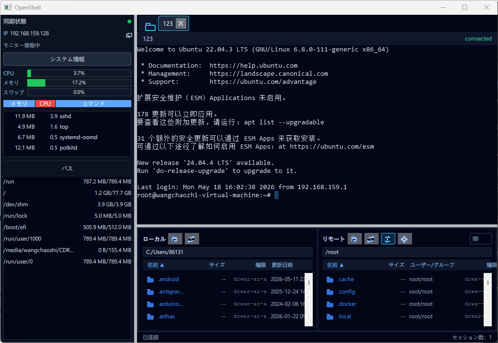

# OpenShell

[English](README.md) | [简体中文](README-CN.md) | 日本語

OpenShell は Qt 6 / QML / C++20 で構築されたクロスプラットフォームの SSH / SFTP ターミナルクライアントです。FinalShell に近い操作感を目指しており、左側に接続管理、中央にマルチタブターミナル、下部にローカル/リモートのデュアルペインファイルブラウザーを配置しています。

本プロジェクトはすでに実用的な機能を備えています：SSH 接続、ターミナルレンダリング、SFTP ブラウジングと転送、リモートファイルの開く/編集/アップロード、システムトレイ、基本的な多言語対応。



## 機能

- 接続プロファイル管理：名前、プロトコル、ホスト、ポート、ユーザー名、パスワード/秘密鍵/エージェント認証、グループ、メモ。
- SSH ターミナルセッション：libssh2 ベースの実接続、マルチタブ、リサイズ対応、Ctrl+C 割り込みサポート。
- ターミナルレンダリング：libvterm スクリーンモデルをカスタム `QQuickPaintedItem` でレンダリング、カーソル・クリア・基本色・テキスト属性に対応。
- ターミナル選択コピー：ドラッグ選択、全選択、ダブルクリック単語選択、トリプルクリック行選択、Shift 拡張選択、選択時自動コピー。
- SFTP デュアルペインファイルブラウザー：ローカル/リモートのディレクトリ閲覧、ソート、アップロード、ダウンロード、削除、名前変更、ファイル/フォルダー作成、chmod。
- リモートディレクトリ同期：ターミナルのプロンプトが示すカレントディレクトリとリモートファイルブラウザーを自動同期。
- リモートファイルオープン：リモートファイルをダブルクリックして、システム既定アプリ・指定エディター・内蔵エディターで開く。
- 編集アップロードバック：外部エディターで保存後に自動でリモートへアップロード。内蔵エディターは保存時にアップロード。
- 踏み台ホスト (ProxyJump)：libssh2 のカスタム send/recv コールバック経由で `direct-tcpip` トンネルを張り、目標サーバーへ接続。
- ローカルポート転送 (`-L`)：ローカルポートをバインドし、確立済みセッション経由でリモートへトンネリング。Remote (`-R`) / Dynamic (`-D`) は未実装で、設定すると明示的なエラーになります。
- 自動再接続：プロファイルごとに設定可能。指数バックオフ（最大 30 秒）。
- 認証情報：パスワード/秘密鍵パスフレーズは OS の鍵束（デスクトップは QtKeychain 経由で macOS Keychain / Windows 資格情報マネージャー / Linux libsecret、iOS はネイティブ Sec API）に保存。旧 JSON の平文は初回ロード時に鍵束へ移行されます。
- システムトレイ：ウィンドウの表示/非表示、接続のクイックオープン、言語切り替え、終了。
- 多言語対応：簡体字中国語・日本語を `.qm` で内蔵。韓国語・ドイツ語は翻訳待ちの空骨格。英語はソース文字列フォールバック。

## 動作要件

- Qt 6.6 以上（`Quick`、`QuickControls2`、`Widgets`、`Network`、`Concurrent`、`LinguistTools` モジュールが必要。テストには `Test` も必要）。
- CMake 3.16 以上。
- C++20 対応コンパイラー：Windows では MSVC 2022 を推奨。Linux/macOS では GCC/Clang も利用可能。
- Windows では Qt の `msvc2022_64` キットを使用してください。MinGW との混在は避けてください。

## ビルド

### Windows 推奨スクリプト

```bat
scripts\run-vs-debug.bat
```

CMake または Qt のパスを指定する場合：

```bat
set "CMAKE_EXE=E:\Qt\Tools\CMake_64\bin\cmake.exe"
set "QT_PREFIX=E:\Qt\6.11.1\msvc2022_64"
scripts\run-vs-debug.bat
```

Qt ランタイムのデプロイ：

```bat
scripts\deploy-vs-debug.bat
scripts\deploy-vs-release.bat
```

### CMake

```bash
cmake -S . -B build -DCMAKE_PREFIX_PATH=/path/to/Qt
cmake --build build --config Debug
```

テストを有効にする場合：

```bash
cmake -S . -B build -DOPENSHELL_BUILD_TESTS=ON -DCMAKE_PREFIX_PATH=/path/to/Qt
cmake --build build --config Debug
ctest --test-dir build
```

## プロジェクト構成

```text
.
├── CMakeLists.txt
├── Main.qml
├── src/
│   ├── AppController.*          # アプリケーションファサード（QML・セッション・SFTP・設定・トレイ）
│   ├── ConnectionCatalog.*      # 接続プロファイルの永続化
│   ├── SessionController.*      # アクティブSSHセッション管理
│   ├── SettingsStore.*          # QSettings ラッパー
│   ├── TranslationManager.*     # 実行時言語切り替え
│   ├── TrayController.*         # システムトレイ統合
│   ├── ssh/                     # libssh2 SSH/SFTP ワーカーとリモートファイル操作
│   └── terminal/                # libvterm スクリーンモデルと QML ターミナルウィジェット
├── qml/
│   ├── MainWindow.qml
│   ├── Sidebar.qml
│   ├── ConnectionEditor.qml
│   ├── SessionTabs.qml
│   ├── TerminalView.qml
│   ├── FileBrowser.qml
│   └── AccentCard.qml
├── translations/
│   ├── OpenShell_zh_CN.ts
│   ├── OpenShell_ja_JP.ts
│   ├── OpenShell_ko_KR.ts        # 空骨格
│   └── OpenShell_de_DE.ts        # 空骨格
├── tests/
│   ├── test_connection_catalog.cpp
│   ├── test_vt_screen.cpp
│   ├── test_session_controller.cpp
│   ├── test_sftp_transfer.cpp
│   └── test_sftp_connection_pool.cpp
└── docs/
    ├── architecture.md
    ├── mobile-adaptation-plan.md
    └── connection-encryption-design.md
```

## データストレージ

接続プロファイルの保存先：

```text
QStandardPaths::AppDataLocation/connections/<id>.json
```

パスワードや秘密鍵のパスフレーズ（踏み台ホストのクレデンシャル含む）は OS の鍵束に保存されます。デスクトップでは QtKeychain 経由で macOS Keychain / Windows 資格情報マネージャー / Linux libsecret を、iOS ではネイティブの Sec API を使用します。旧 JSON に残っていた平文は初回ロード時に自動で鍵束へ移行されます。Android では現状 base64 を被せて app プライベートな `QSettings` に書き込む暫定実装で、サンドボックスで保護されているものの **静止状態では暗号化されていません**。AndroidKeyStore + AES-GCM への置き換えは [AGENTS.md](AGENTS.md) に課題として記録されています。

JSON ファイル全体の暗号化（Git 同期向け）は未実装です。設計案は [docs/connection-encryption-design.md](docs/connection-encryption-design.md) を参照してください。

リモートファイルのオープン/編集ワークフローでは、まずファイルをシステムの一時ディレクトリにダウンロードします：

```text
<Temp>/OpenShell/remote-open/<uuid>/
```

アップロードバックが有効な場合、OpenShell は一時ファイルの変更を監視し、元のリモートパスに自動でアップロードします。

## 主な操作

- 接続をダブルクリック：SSH セッションを開く。
- ターミナルを右クリック：コピー、貼り付け、全選択、Ctrl+C 送信、画面クリア。
- ターミナルでドラッグ選択：マウスリリース時に自動コピー。
- ターミナルでダブルクリック/トリプルクリック：単語/行を選択して自動コピー。
- リモートのディレクトリをダブルクリック：そのディレクトリに移動。
- リモートのファイルをダブルクリック：設定に従ってファイルを開く。
- リモート同期ボタン：ターミナルのカレントディレクトリに追従。
- リモート設定ボタン：システム既定アプリ・指定テキストエディター・内蔵エディターを選択。

## サポート

OpenShell は余暇に開発されています。役に立った場合は、コーヒー一杯のサポートをいただけると嬉しいです。

[PayPal でサポート](https://paypal.me/wangchaozhi123)

## ロードマップ

- 接続 JSON の暗号化（Git 同期のため、設計は `docs/connection-encryption-design.md`）。
- Android のクレデンシャル保管強化：現在の `QSettings` 暫定実装を `AndroidKeyStore` 経由の AES-GCM ラップに置き換える。
- モバイルのフォルダーアップロード：SAF / iOS security-scoped tree ブックマーク対応の走査器（ファイル選択は `pickMobileFileAsync` で既に接続済み）。
- Remote (`-R`) と Dynamic (`-D`) ポートフォワーディング（Local `-L` は実装済み）。
- ターミナル強化：スクロールバック履歴、検索、より広い VT 互換性、コピー書式の改善。
- SFTP 強化：転送キュー、レジューム対応、競合処理、バッチ操作。
- サーバー監視：SSH exec 経由で CPU・メモリ・ディスク・ネットワーク統計を収集してダッシュボードに表示。
- 翻訳：`OpenShell_ko_KR.ts` / `OpenShell_de_DE.ts` の充足（現在は空骨格）。
- パッケージング：Windows/macOS/Linux のリリースワークフローの整備。

詳細なアーキテクチャについては [docs/architecture.md](docs/architecture.md) および [AGENTS.md](AGENTS.md) を参照してください。

## ライセンス

OpenShell は [GNU General Public License v3.0](LICENSE) のもとで公開されています。ソースコード・バイナリの再配布（改変版を含む）はすべて GPL v3 のもとで継続して公開し、対応するソースコードを同梱する必要があります。
