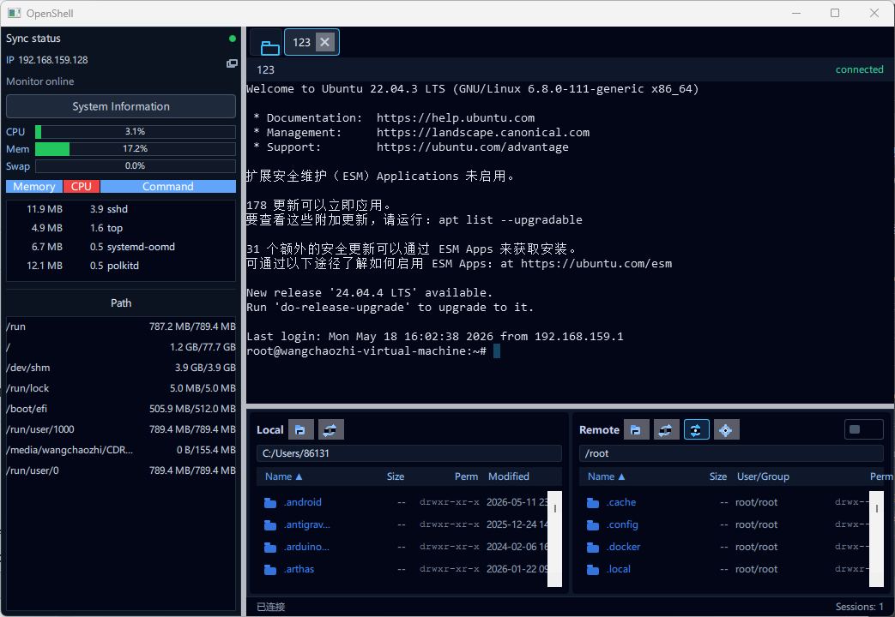

# OpenShell

English | [简体中文](README-CN.md) | [日本語](README-JP.md)

OpenShell is a cross-platform SSH / SFTP terminal client built with Qt 6, QML, and C++20. It aims for a workflow similar to FinalShell: connection management on the left, multi-tab terminals in the main area, and a local/remote file browser below.

The project is no longer only a UI skeleton. It already includes real SSH sessions, terminal rendering, SFTP browsing and transfer operations, remote file open/edit/upload-back workflows, a system tray, and basic localization.



## Features

- Connection profiles: name, protocol, host, port, username, password/private key/agent auth, group, and notes.
- SSH terminal sessions: real libssh2-backed connections, multi-tab sessions, resize handling, and Ctrl+C interrupt support.
- Terminal rendering: libvterm screen model rendered through a custom `QQuickPaintedItem`, with cursor, clear screen, basic colors, and text attributes.
- Terminal selection and copy: drag selection, select all, double-click word selection, triple-click line selection, Shift-extend selection, and copy-on-selection.
- SFTP dual-pane file browser: local/remote directory browsing, sorting, upload, download, delete, rename, create file/folder, and chmod.
- Remote directory sync: optionally sync the remote file browser to the current directory detected from the terminal prompt.
- Remote file opening: double-click remote files and open them with the system default app, a configured editor, or the built-in editor.
- Edit upload-back: external editor saves can be watched and uploaded back to the original remote path; the built-in editor uploads on save.
- Jump host (ProxyJump): chain through a bastion via a libssh2 `direct-tcpip` tunnel with custom send/recv callbacks.
- Local port forwarding (`-L`): bind a local port and tunnel it to a remote host through the established session. Remote (`-R`) and dynamic (`-D`) forwarders are not yet implemented and surface a clear error.
- Auto reconnect: configurable per profile, with exponential backoff capped at 30 s.
- Credentials: passwords / passphrases stored in the OS keychain (macOS Keychain / Windows Credential Manager / libsecret on Linux via QtKeychain; iOS via Sec API). Plaintext fields in legacy JSON are migrated on first load.
- System tray: show/hide window, quick-open connections, language switching, and quit.
- Localization: English, Simplified Chinese, and Japanese ship as compiled `.qm` resources. Korean and German are present as empty skeletons awaiting translation. English is the source language and uses no translation file.

## Requirements

- Qt 6.6+ with `Quick`, `QuickControls2`, `Widgets`, `Network`, `Concurrent`, and `LinguistTools`; tests also require `Test`.
- CMake 3.16+.
- A C++20 compiler: MSVC 2022 is recommended on Windows; GCC/Clang work on Linux/macOS.
- On Windows, use the Qt `msvc2022_64` kit. Do not mix it with MinGW.

## Build

### Recommended Windows Scripts

```bat
scripts\run-vs-debug.bat
```

Override CMake or Qt paths when needed:

```bat
set "CMAKE_EXE=E:\Qt\Tools\CMake_64\bin\cmake.exe"
set "QT_PREFIX=E:\Qt\6.11.1\msvc2022_64"
scripts\run-vs-debug.bat
```

Deploy Qt runtime files:

```bat
scripts\deploy-vs-debug.bat
scripts\deploy-vs-release.bat
```

### CMake

```bash
cmake -S . -B build -DCMAKE_PREFIX_PATH=/path/to/Qt
cmake --build build --config Debug
```

Enable tests:

```bash
cmake -S . -B build -DOPENSHELL_BUILD_TESTS=ON -DCMAKE_PREFIX_PATH=/path/to/Qt
cmake --build build --config Debug
ctest --test-dir build
```

## Project Layout

```text
.
├── CMakeLists.txt
├── Main.qml
├── src/
│   ├── AppController.*          # Application facade for QML, sessions, SFTP, settings, and tray
│   ├── ConnectionCatalog.*      # Connection profile persistence
│   ├── SessionController.*      # Active SSH session management
│   ├── SettingsStore.*          # QSettings wrapper
│   ├── TranslationManager.*     # Runtime language switching
│   ├── TrayController.*         # System tray integration
│   ├── ssh/                     # libssh2 SSH/SFTP workers and remote file operations
│   └── terminal/                # libvterm screen model and QML-painted terminal widget
├── qml/
│   ├── MainWindow.qml
│   ├── Sidebar.qml
│   ├── ConnectionEditor.qml
│   ├── SessionTabs.qml
│   ├── TerminalView.qml
│   ├── FileBrowser.qml
│   └── AccentCard.qml
├── translations/
│   ├── OpenShell_zh_CN.ts
│   ├── OpenShell_ja_JP.ts
│   ├── OpenShell_ko_KR.ts        # empty skeleton
│   └── OpenShell_de_DE.ts        # empty skeleton
├── tests/
│   ├── test_connection_catalog.cpp
│   ├── test_vt_screen.cpp
│   ├── test_session_controller.cpp
│   ├── test_sftp_transfer.cpp
│   └── test_sftp_connection_pool.cpp
└── docs/
    ├── architecture.md
    ├── mobile-adaptation-plan.md
    └── connection-encryption-design.md
```

## Data Storage

Connection profiles are stored at:

```text
QStandardPaths::AppDataLocation/connections/<id>.json
```

Passwords and private key passphrases (including jump-host credentials) are kept in the OS keychain — macOS Keychain, Windows Credential Manager, and Linux libsecret on desktop via QtKeychain, and the iOS Keychain via the native Sec API. The JSON file no longer contains these fields; legacy plaintext fields are migrated into the keychain on first load. On Android the current backend writes a base64-wrapped value into the app's private `QSettings`, which is sandboxed but **not** encrypted at rest — replacement with AndroidKeyStore-backed AES-GCM is tracked in [AGENTS.md](AGENTS.md).

Whole-file encryption of the JSON (for safe Git sync) is not implemented yet; see [docs/connection-encryption-design.md](docs/connection-encryption-design.md) for the design sketch.

Remote file open/edit workflows first download files to:

```text
<Temp>/OpenShell/remote-open/<uuid>/
```

When upload-back is enabled, OpenShell watches the temporary file and uploads changes back to the original remote path.

## Common Operations

- Double-click a connection in the sidebar to open an SSH session.
- Right-click the terminal for Copy, Paste, Select All, Send Ctrl+C, and Clear Screen.
- Drag-select terminal text to copy on mouse release.
- Double-click or triple-click terminal text to select a word or line and copy immediately.
- Double-click a remote directory to enter it.
- Double-click a remote file to open it according to the configured open mode.
- Use the remote sync button to follow the terminal's current directory.
- Use the remote settings button to choose the system default app, a configured text editor, or the built-in editor.

## Support

OpenShell is built in spare time. If it saves you time, a coffee would be appreciated.

[Support via PayPal](https://paypal.me/wangchaozhi123)

## Roadmap

- Connection JSON encryption for Git sync (design in `docs/connection-encryption-design.md`).
- Android credential storage hardening: replace the sandbox-only `QSettings` stub with an `AndroidKeyStore`-wrapped AES-GCM backend.
- Mobile folder upload via SAF / iOS security-scoped tree bookmarks (file picker already wired through `pickMobileFileAsync`).
- Remote (`-R`) and dynamic (`-D`) port forwarding (local `-L` is done).
- Terminal improvements: scrollback history, search, broader VT compatibility, and copy formatting refinements.
- SFTP improvements: transfer queue, resume support, conflict handling, and batch operations.
- Server monitoring: collect CPU, memory, disk, and network stats through SSH exec and render a dashboard.
- Translations: populate `OpenShell_ko_KR.ts` / `OpenShell_de_DE.ts` (currently empty skeletons).
- Packaging: improve Windows/macOS/Linux release workflows.

See [docs/architecture.md](docs/architecture.md) and [AGENTS.md](AGENTS.md) for more project notes.

## License

OpenShell is released under the [GNU General Public License v3.0](LICENSE). Any redistribution of the source code or binaries — including modified versions — must remain under GPL v3 and ship the corresponding source.
